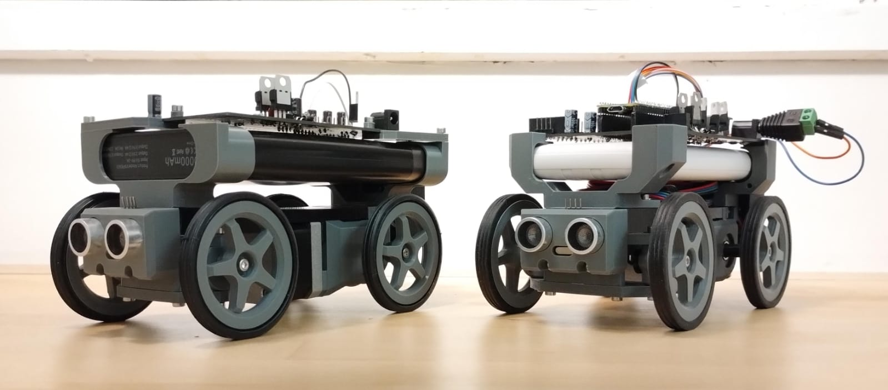
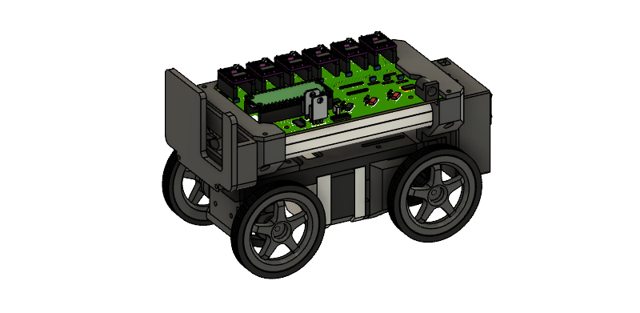
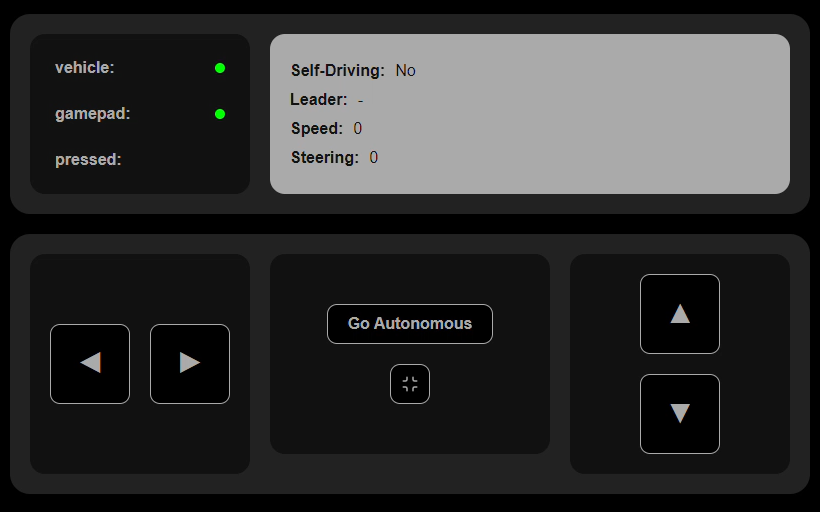

# Robot Vehicle V1

Welcome! This is a small project of a robot in a conventional vehicle configuration
(i.e. steering in the front and engine in the back axle). The project was born as a
proof-of-concept for connectivity features, namely a real-time web interface for
commanding microcontrollers and support for gamepads.

# What this project does

It is a vehicle controlled over a local network. The following features are supported:
- real-time control and update of the vehicle state (speed, steering angle, vehicle status);
- gamepad support for the vehicle control (gamepad must be compatible with the browser);
- autonomous mode - the robot switches to a pre-defined sequence of movements.
- follower mode - the robot follows another vehicle connnected on the same network.
- emergency mode - the robot halts the operation with an emergency maneuver.

## The vehicle

Since this project, especially the hardware, was developed in a hurry for a master's
subject, there is plenty of room for improvement. However, the current structure is
sturdy and with decent cable management and weight distribution, so it will do the job
just fine. I had plenty of fun working on this, though, and will likely make upgrades to
eventually release a V2 chassis.

## The interface

Once both the device (i.e. cellphone or computer) and robot are connected to the
same network, head to the robot's IP adress (which will likely be 192.168.0.[id],
where [id] is the robot ID assigned in the ESP01 code). You'll see the above page.
It is responsive, which means it will try its best to fit the many screen sizes
we have nowadays.

## License

This project is available under the MIT license. Feel free to get inspired, make your
own changes and improvements and share your results with me if you wish!

## Get in touch

You can find me on [LinkedIn](https://www.linkedin.com/in/alexpaschoaletto/).